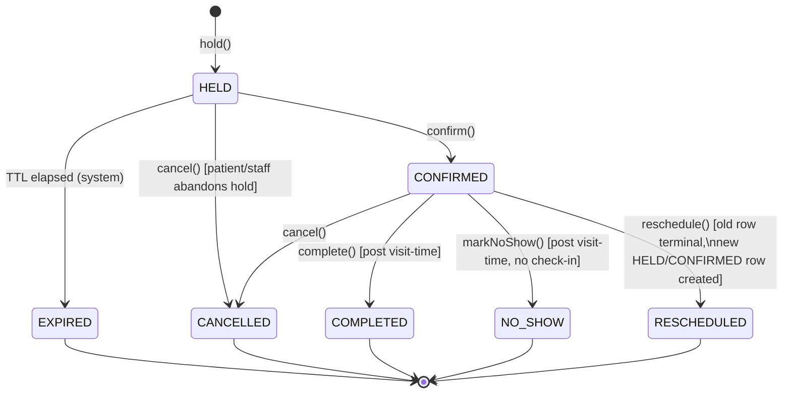

# Appointment Engine

The appointment engine (`packages/domain-appointment`) is the single owner of
booking truth. It is a plain TypeScript package with **no dependency on
Express/Fastify, WhatsApp SDKs, Google/Microsoft SDKs, or WordPress** — its
only dependency is `packages/db` (Prisma) and `packages/shared`. Channel
adapters (dashboard API routes, WhatsApp conversation service, WordPress
plugin's REST calls) are all equally "just a caller" of this package's
public functions. This is what makes "appointment availability must never
rely only on cached information" and "prevent double booking" enforceable in
one place instead of three.

## 1. Two concepts: Slot vs. Appointment

The task's 8 states (`Available, Held, Confirmed, Rescheduled, Cancelled,
Completed, No-show, Expired`) mix a property of *time* ("is this slot
available") with the lifecycle of a *booking record*. Modeling them as one
enum on one table produces races and ambiguity (what "expires" — the slot or
the row?). So the engine splits them:

- **Availability** is *computed*, not stored: derived live from
  `doctor_availability` recurring templates, minus active `appointments`,
  minus synced `calendar_busy_blocks`. There is no `AVAILABLE` row anywhere;
  "available" is the absence of a conflicting `slots`/`appointments` row for
  that doctor+time.
- **Appointment** is a persisted record whose `status` enum is exactly the
  other 7 states: `HELD, CONFIRMED, RESCHEDULED, CANCELLED, COMPLETED,
  NO_SHOW, EXPIRED`. A row only comes into existence at hold time.

## 2. State machine



Transition table (every transition runs inside the engine, never patched
directly by a caller):

| From | To | Trigger | Guard |
|---|---|---|---|
| *(none)* | `HELD` | `holdSlot(doctorId, startAt, patientId, channel)` | Slot not already actively held/confirmed (DB-enforced, §4) |
| `HELD` | `CONFIRMED` | `confirmAppointment(id)` | Must be `HELD` and `hold_expires_at > now()` |
| `HELD` | `EXPIRED` | `expireHold(id)` (worker, TTL job) | Must still be `HELD` at execution time (re-checked in the same transaction — see §5) |
| `HELD` | `CANCELLED` | `cancelAppointment(id, reason)` | Must be `HELD` |
| `CONFIRMED` | `CANCELLED` | `cancelAppointment(id, reason)` | Must be `CONFIRMED`; policy layer enforces cancellation window if tenant configures one |
| `CONFIRMED` | `RESCHEDULED` | `rescheduleAppointment(id, newStartAt)` | Old row → `RESCHEDULED` (terminal) + new row created via `holdSlot` with `rescheduled_from_id` set, **in one transaction** |
| `CONFIRMED` | `COMPLETED` | `completeAppointment(id)` (staff action, or auto-complete job after visit end + grace period) | `now() >= end_at` |
| `CONFIRMED` | `NO_SHOW` | `markNoShow(id)` (staff action, or auto job after grace period if no explicit complete) | `now() >= end_at + grace_period` |

Every transition writes an `appointment_events` row and emits a domain event
(`AppointmentHeld`, `AppointmentConfirmed`, ...) — see `ARCHITECTURE.md` §6.
No transition is allowed to skip states (e.g. `HELD → COMPLETED` directly is
rejected by the engine even if some caller attempts it).

## 3. The hold mechanism

```
holdSlot(tenantId, doctorId, serviceId, startAt, patientId, channel, idempotencyKey)
```

1. Compute `endAt` from `service.duration_minutes`.
2. Begin a transaction; `SET LOCAL app.tenant_id`.
3. Check the idempotency key first (§6) — if a prior identical request
   already produced a result, return it and stop.
4. `INSERT INTO slots (...) ON CONFLICT (tenant_id, doctor_id, start_at) DO
   NOTHING RETURNING id`, then `SELECT id FROM slots WHERE ... FOR UPDATE`
   regardless of whether the insert happened — this guarantees exactly one
   transaction holds the row lock for this doctor+time at any instant, so
   two concurrent hold attempts serialize instead of racing.
5. Check for an existing active appointment on that slot (`HELD`/`CONFIRMED`)
   — if present, abort with `SLOT_UNAVAILABLE` (this is the actual
   double-booking rejection path; the unique partial index is the backstop
   if this check is ever wrong).
6. Also re-verify against `doctor_availability` and `calendar_busy_blocks` —
   a slot that looked open when the client fetched `/availability` seconds
   ago might have just been blocked by a calendar change; **never trust the
   client's belief that a slot is open**, always recompute inside the
   transaction.
7. Insert the `appointments` row with `status = HELD`,
   `hold_expires_at = now() + tenant.hold_ttl_minutes (default 15)`.
8. Commit. Enqueue the `hold-expiry` delayed job (`delay = hold_ttl_minutes`)
   *after* commit (outbox-style — see §5 for why not before).
9. Emit `AppointmentHeld`.

Steps 4–7 all happen inside one transaction with the row lock held for the
duration, which is what makes this safe under concurrency — not the queue,
not application-level mutexes, not Redis locks (Redis is used only as an
optional fast-path pre-check to avoid wasted transactions under heavy
contention on the same doctor, never as the correctness mechanism).

## 4. Preventing double booking — the layered guarantee

1. **Row lock** during the hold transaction (§3 step 4) — serializes
   concurrent attempts on the same doctor+time.
2. **Partial unique index** `uq_appointment_active_slot` on
   `appointments(slot_id) WHERE status IN ('HELD','CONFIRMED')` — the
   database physically refuses a second active appointment on the same slot
   even if application logic has a bug, runs on a second untested code path,
   or a future engineer bypasses the engine's function and writes raw SQL.
3. **Unique index** `uq_slot_doctor_start` on `slots(tenant_id, doctor_id,
   start_at)` — guarantees at most one `slots` row per doctor+time to lock
   against in the first place.
4. **Idempotency keys** (§6) — a retried *client* request (network timeout,
   double-tap) never becomes a second booking attempt at all.

A failing unique-constraint insert is treated as an expected concurrency
outcome (mapped to `409 SLOT_UNAVAILABLE`, not a 500) — the engine always
catches the specific Postgres unique-violation error code and converts it,
rather than only relying on the pre-check in step 5 above.

## 5. Hold expiry — why it's a re-checking job, not a pure timer

The delayed BullMQ job fires at `hold_expires_at`, but it does **not**
blindly set `status = EXPIRED`. It opens a transaction, locks the
appointment row, and only transitions if `status = HELD AND hold_expires_at
<= now()` — because the patient may have confirmed in the last few hundred
milliseconds before the job ran, and a naive job would silently cancel a
just-confirmed booking. This same "recheck inside the transaction, trust
nothing computed earlier" discipline applies everywhere in the engine.

A patient hitting confirm *after* expiry (job already ran) gets a clean
`410 HOLD_EXPIRED` and is routed back to slot selection — never a
partial/ambiguous state.

## 6. Idempotency

Every mutating engine entry point accepts an `idempotencyKey` (required for
`holdSlot`; optional-but-recommended for `confirmAppointment`,
`cancelAppointment`, `rescheduleAppointment`). Backed by the
`idempotency_keys` table:

1. On request, `SELECT` by `(tenant_id, key, endpoint)`. If found and the
   `request_hash` (hash of the semantically relevant request body) matches,
   return the stored response verbatim — no side effects re-run.
2. If found with a **different** request hash, reject `422
   IDEMPOTENCY_KEY_REUSED` — surfaces client bugs instead of silently doing
   the wrong thing.
3. If not found, proceed, and write the key + response atomically in the
   same transaction as the business mutation (so a crash between them can't
   leave an orphaned "success recorded but nothing happened" or vice versa).

WordPress and WhatsApp adapters generate the idempotency key deterministically
per user action (e.g. WhatsApp: hash of `wa_message_id`; WordPress widget:
a UUID generated client-side once per booking attempt and reused on retry).

## 7. Availability computation (read path)

`GET availability(doctorId, dateRange, serviceId)`:

1. Project `doctor_availability` recurring templates across the requested
   range into candidate start times.
2. Subtract times covered by `appointments` in `HELD`/`CONFIRMED` for that
   doctor.
3. Subtract times covered by `calendar_busy_blocks` (synced external
   calendar events) for that doctor.
4. Return the remainder.

This is a read-only, lock-free query — safe to compute frequently and cache
briefly (a few seconds, keyed by doctor+date, invalidated on any write to
that doctor's appointments or busy blocks) purely as a latency optimization.
The cache is **never** consulted by the write path (`holdSlot` always
recomputes/re-checks against live tables inside its transaction, per §3
step 6) — this is the concrete implementation of "must never rely only on
cached information."

## 8. Reschedule semantics

`rescheduleAppointment(existingId, newStartAt)` runs as one transaction:

1. Lock and validate the existing appointment is `CONFIRMED` (or `HELD`,
   for a patient changing their mind before confirming).
2. Run the full `holdSlot` logic (§3) for the new slot, with
   `rescheduled_from_id = existingId`.
3. If the new hold succeeds, transition the old appointment to
   `RESCHEDULED`.
4. If the new hold fails (slot taken), the whole transaction rolls back —
   the original appointment is untouched and the caller gets
   `SLOT_UNAVAILABLE`, never a state where the old booking is cancelled but
   the new one didn't take.

The new row starts its own lifecycle at `HELD` (patient must still confirm)
unless the reschedule was staff-initiated from the dashboard, in which case
it's created directly at `CONFIRMED` (no re-confirmation needed from a
patient who didn't initiate the change) — configurable per tenant policy.

## 9. Completion / no-show

Not patient-facing. A cron worker scans `CONFIRMED` appointments past
`end_at + grace_period` (tenant-configurable, default 30 min) with no
explicit staff action, and auto-transitions to `NO_SHOW`. Staff can also
explicitly mark `COMPLETED` or `NO_SHOW` from the dashboard at any time
after `start_at`. Both are terminal, both write `appointment_events`.

## 10. What the engine explicitly does not do

- Does not know about WhatsApp message formats, Google/Microsoft API
  shapes, or WordPress. It only emits domain events and exposes typed
  functions.
- Does not send notifications itself — that's `domain-notification`,
  triggered by the same domain events (see `ARCHITECTURE.md` §6).
- Does not decide RBAC — callers (API Gateway routes) check permission
  before invoking engine functions; the engine trusts its caller has already
  authorized the action but still always re-derives `tenant_id` server-side
  and never accepts a tenant id from request input for scoping decisions.
