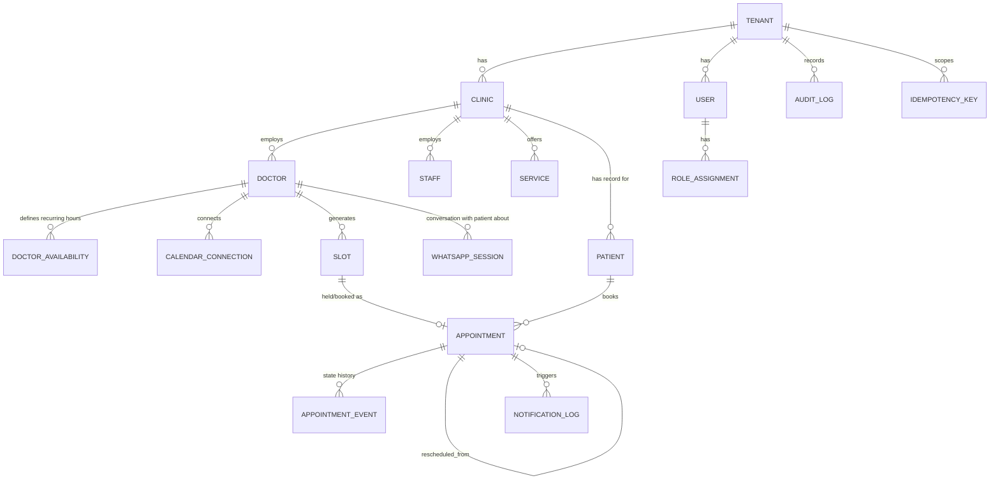

# Database Design

PostgreSQL 15+, accessed exclusively through Prisma from `packages/db`.
Timestamps are stored `timestamptz`, always written/read in UTC; display
conversion to IST (or the tenant's configured timezone) happens at the
presentation layer only.

## 1. Multi-tenancy model

Shared database, shared schema. Every tenant-scoped table carries a
non-nullable `tenant_id uuid` foreign key to `tenants.id`.

Two enforcement layers, deliberately redundant:

1. **Application layer** — every Prisma query goes through a repository
   function that requires a `tenantId` from the authenticated request
   context; there is no code path that queries a tenant-scoped table
   without it (enforced by lint rule banning direct `prisma.<model>` calls
   outside `packages/db/repositories/*`, which always inject the filter).
2. **Database layer** — PostgreSQL Row-Level Security. Every tenant-scoped
   table has RLS enabled with a policy:

   ```sql
   ALTER TABLE appointments ENABLE ROW LEVEL SECURITY;
   CREATE POLICY tenant_isolation ON appointments
     USING (tenant_id = current_setting('app.tenant_id', true)::uuid);
   ```

   The application sets `SET LOCAL app.tenant_id = '<uuid>'` at the start of
   every transaction, derived from the authenticated principal's tenant
   membership (JWT claim / API key record) — **never** from a client-supplied
   header or body field. The Postgres role the app connects as has `BYPASSRLS`
   revoked. A platform-admin cross-tenant query path exists as a *separate*,
   explicitly audited service role used only by `domain-tenant` platform
   operations, never by request-serving code.

This means even a bug that forgets a `WHERE tenant_id = ...` clause fails
closed (returns zero rows) rather than leaking another tenant's data.

Global (non-tenant-scoped) tables: `tenants` itself, `platform_admins`,
`db_migrations`.

## 2. Entity-relationship overview



## 3. Core tables

### `tenants`
Platform-level record for a clinic group/organization.
`id, name, slug (unique), status (ACTIVE|SUSPENDED|TRIAL), timezone default 'Asia/Kolkata', locale default 'en-IN', created_at, updated_at`

### `clinics`
A physical/logical location under a tenant (a tenant may have 1..N clinics).
`id, tenant_id, name, address, phone, timezone, business_hours (jsonb), created_at, updated_at`

### `doctors`
`id, tenant_id, clinic_id, user_id (nullable FK to users, if the doctor logs in), display_name, specialty, consultation_duration_minutes default, status (ACTIVE|INACTIVE), created_at, updated_at`

### `staff`
`id, tenant_id, clinic_id, user_id, role (RECEPTIONIST|CLINIC_MANAGER|...), created_at, updated_at`

### `services`
Bookable service/visit types per clinic (e.g. "General Consultation", "Follow-up").
`id, tenant_id, clinic_id, name, duration_minutes, buffer_before_minutes, buffer_after_minutes, is_active`

### `users`
Dashboard-authenticating principals (doctors, staff, tenant admins, platform admins). Patients are **not** rows here — see `patients` below; a patient only gets a `users` row if/when the optional self-service patient portal is enabled (post-v1).
`id, tenant_id (nullable for platform admins), email (unique per tenant), phone, password_hash (argon2id), mfa_secret (encrypted, nullable), status, created_at, updated_at`

### `roles` / `role_assignments`
`roles`: static seed data — `PLATFORM_ADMIN, TENANT_ADMIN, CLINIC_MANAGER, DOCTOR, STAFF`.
`role_assignments`: `id, tenant_id, user_id, role_id, clinic_id (nullable — null means tenant-wide), doctor_id (nullable — scopes a DOCTOR role to themself)`.

### `patients`
Patient record, **scoped to a tenant** (a person seen at two unrelated clinics on the platform is two separate rows — no cross-tenant patient identity linkage, by design, for isolation).
`id, tenant_id, full_name, phone (E.164, unique per tenant), email (nullable), date_of_birth (nullable), preferred_language, whatsapp_opt_in boolean, created_at, updated_at`

Phone is the primary identity key for WhatsApp-originated patients; email/
name are collected opportunistically. No free-text clinical/medical fields
live on this table by design (see `docs/SECURITY.md` — clinical notes, if
ever added, get their own access-controlled table, out of scope for v1).

### `doctor_availability`
Recurring weekly template a doctor's bookable slots are generated from.
`id, tenant_id, doctor_id, clinic_id, day_of_week (0-6), start_time, end_time, slot_duration_minutes, service_id (nullable — restrict this window to one service), effective_from, effective_until (nullable)`

Slots are **derived, not stored long-term as open rows**: availability is
computed on read (`GET /availability`) by projecting `doctor_availability`
templates forward, subtracting existing `appointments` in
(`HELD`,`CONFIRMED`) state and external-calendar busy blocks
(`calendar_busy_blocks`, populated by calendar sync). This avoids having to
pre-materialize and garbage-collect millions of "open" slot rows, and
guarantees availability responses reflect calendar reality at read time
(the "never rely only on cached information" requirement) — the read path
always does this projection live; only the *booking* path materializes a
row (see `slots` below).

### `slots`
A **materialized, lockable row created only at hold time** — this is
deliberately not "every open slot" but "every slot anyone has ever tried to
book," which is what needs a row to lock against. See
`docs/APPOINTMENT_ENGINE.md` for why.
`id, tenant_id, doctor_id, clinic_id, service_id, start_at (timestamptz), end_at (timestamptz)`

```sql
-- The core double-booking guard: only one non-terminal appointment
-- may exist for a given doctor+start_at, enforced by the database,
-- not just application logic.
CREATE UNIQUE INDEX uq_slot_doctor_start
  ON slots (tenant_id, doctor_id, start_at);
```

### `appointments`
The booking record. One row per booking attempt lifecycle up to a terminal
state; reschedule creates a **new** row linked via `rescheduled_from_id`
rather than mutating start time in place, preserving full history.

```
id, tenant_id, clinic_id, doctor_id, patient_id, service_id, slot_id (FK, unique),
status (HELD|CONFIRMED|CANCELLED|RESCHEDULED|COMPLETED|NO_SHOW|EXPIRED),
start_at, end_at,
channel (WHATSAPP|WORDPRESS|DASHBOARD),
hold_expires_at (nullable, set only while HELD),
confirmed_at, cancelled_at, cancelled_reason, cancelled_by (user/patient/system),
rescheduled_from_id (nullable, self-FK),
external_calendar_event_id (nullable, set by calendar sync),
calendar_sync_status (PENDING|SYNCED|CONFLICT|FAILED),
idempotency_key_id (FK, nullable),
created_at, updated_at
```

```sql
CREATE UNIQUE INDEX uq_appointment_active_slot
  ON appointments (slot_id)
  WHERE status IN ('HELD', 'CONFIRMED');
```

That partial unique index is the actual double-booking guard at the
appointment level (belt-and-suspenders with the `slots` unique index above —
one guards slot creation, the other guards active booking against a slot).

### `appointment_events`
Full audit trail of every state transition, independent of the general
`audit_log` (this one is domain-specific and used to drive reminders/UI
timelines, not just compliance).
`id, tenant_id, appointment_id, from_status, to_status, actor_type (PATIENT|STAFF|SYSTEM|DOCTOR), actor_id (nullable), reason (nullable), created_at`

### `idempotency_keys`
`id, tenant_id, key (client-supplied, e.g. UUID), endpoint, request_hash, response_status, response_body (jsonb), created_at, expires_at`
Unique on `(tenant_id, key, endpoint)`. See `docs/API.md` and
`docs/APPOINTMENT_ENGINE.md` for the write path.

## 4. Calendar integration tables

### `calendar_connections`
`id, tenant_id, doctor_id, provider (GOOGLE|MICROSOFT), provider_account_email, access_token_encrypted, refresh_token_encrypted, token_expires_at, scope, status (ACTIVE|NEEDS_REAUTH|DISCONNECTED), watch_channel_id (nullable), watch_resource_id (nullable), watch_expires_at (nullable), created_at, updated_at`

Tokens are envelope-encrypted (KMS data key per row) — see
`docs/SECURITY.md` §Secrets. Never stored or logged in plaintext.

### `calendar_busy_blocks`
Cache of external-calendar busy time, refreshed by sync — used only to
*subtract* from computed availability, never as the sole source of truth for
whether a slot can be booked (the transactional unique-index check at hold
time is authoritative).
`id, tenant_id, doctor_id, connection_id, external_id, start_at, end_at, last_synced_at`

### `calendar_sync_state`
Per-connection sync cursor bookkeeping (Google `syncToken` / Microsoft
`deltaLink`), `id, connection_id, sync_token, delta_link, last_full_sync_at`.

## 5. WhatsApp tables

### `whatsapp_sessions`
`id, tenant_id, patient_phone (E.164), state (see docs/WHATSAPP.md), context (jsonb — e.g. selected clinic/doctor/slot in progress), appointment_id (nullable, once a hold exists), expires_at, created_at, updated_at`

### `whatsapp_messages`
Inbound/outbound log, and the idempotency guard for webhook delivery.
`id, tenant_id, direction (IN|OUT), wa_message_id (unique, nullable for outbound-before-send), session_id (nullable), template_name (nullable), payload_summary (jsonb, redacted), status, created_at`

```sql
CREATE UNIQUE INDEX uq_wa_inbound_dedup
  ON whatsapp_messages (wa_message_id) WHERE direction = 'IN';
```

## 6. Notification & audit

### `notification_log`
`id, tenant_id, appointment_id (nullable), channel (WHATSAPP|EMAIL), template, recipient (masked in logs beyond last 4 digits), status (QUEUED|SENT|FAILED|DELIVERED|READ), provider_message_id, error, created_at`

### `audit_log`
Append-only. No `UPDATE`/`DELETE` grant for the application role — enforced
with a `REVOKE` and, for defense in depth, a `BEFORE UPDATE OR DELETE`
trigger that raises an exception.
`id, tenant_id (nullable — platform-level actions), actor_type (USER|PATIENT|SYSTEM|API_KEY), actor_id, action, resource_type, resource_id, before (jsonb), after (jsonb), ip, user_agent, request_id, created_at`

Indexed on `(tenant_id, created_at)` and `(resource_type, resource_id)` for
compliance lookups.

## 7. Concurrency & correctness mechanisms (index)

Detailed in `docs/APPOINTMENT_ENGINE.md`; summarized here as a database
feature list:

- `SELECT ... FOR UPDATE` on the target `slots` row (created via
  `INSERT ... ON CONFLICT DO NOTHING` then locked) inside the hold
  transaction — serializes concurrent hold attempts on the same slot.
- Partial unique index `uq_appointment_active_slot` — database-level
  guarantee against double booking even if application locking is ever
  bypassed by a bug or a second writer.
- `idempotency_keys` unique constraint — replays of the same client request
  return the original result instead of creating a second appointment.
- All multi-statement transitions run inside a single `SERIALIZABLE` or
  `READ COMMITTED` + explicit row lock transaction (chosen per operation in
  `docs/APPOINTMENT_ENGINE.md` §Concurrency) — never multiple round trips
  with a check-then-act gap.

## 8. Migrations

Prisma Migrate, one migration history in `packages/db/prisma/migrations`,
applied by the Jenkins deploy pipeline as a pre-deploy step (`prisma migrate
deploy`), never `db push` in any non-local environment. RLS policies and the
audit-log immutability trigger are hand-written SQL migrations (Prisma
schema doesn't express RLS), checked into the same migrations directory so
they're versioned and applied in order.
