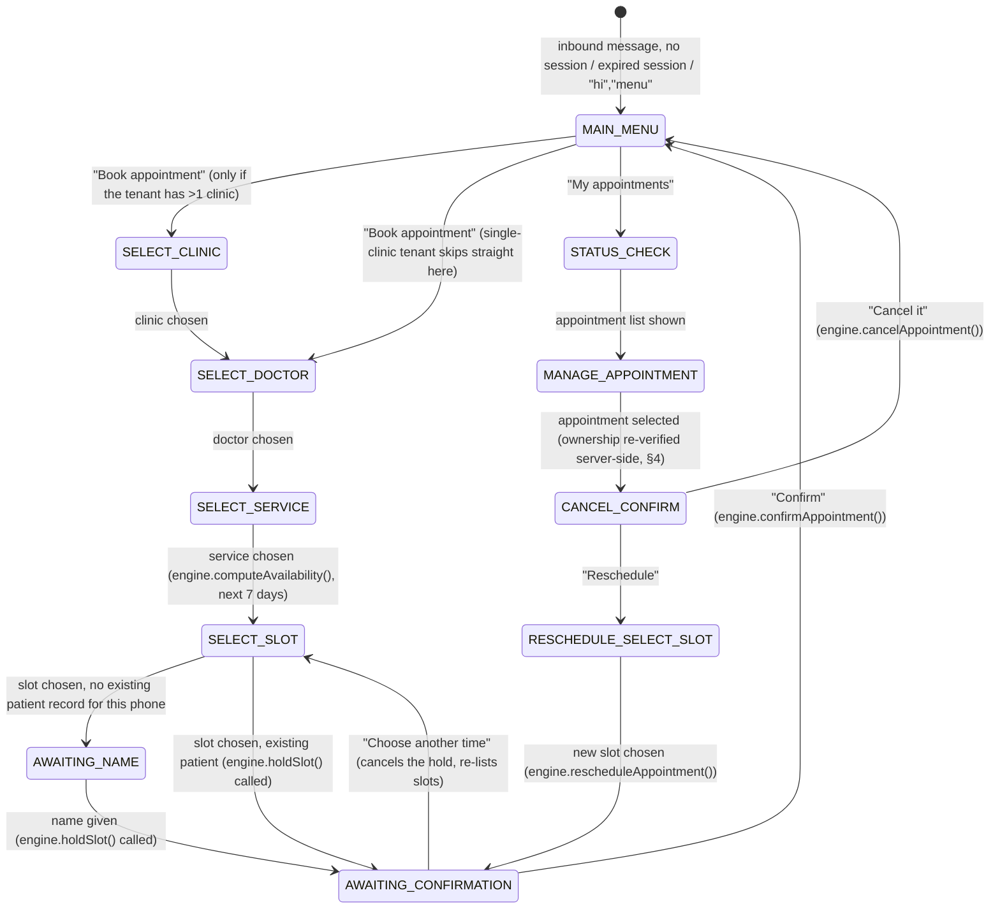

# WhatsApp Integration

Channel: **WhatsApp Business Platform (Cloud API)**, via Meta's hosted
endpoint (not the on-prem Business API). `domain-whatsapp` owns everything
in this document; it calls the appointment engine's public functions for
any actual booking action — it never touches `appointments`/`slots` tables
directly.

## 1. Why WhatsApp needs its own conversation state machine

WhatsApp is a stateless webhook channel — each inbound message is an
isolated HTTP POST from Meta. To let a patient say "10:30" in reply to a
list of slots, the service needs to remember *what it last asked* per
patient. That's `whatsapp_sessions` (`docs/DATABASE.md` §5): a short-lived
state machine per `(tenant, patient_phone)`, independent of the appointment
engine's own state machine.

## 2. Conversation states

As implemented in `packages/domain-whatsapp/src/conversation.ts`:

Session `context` (jsonb, `whatsapp_sessions.context`) carries the
in-progress selection (clinic id, doctor id, service id, appointment id
being rescheduled/cancelled). Session `expires_at` is a 10-minute idle TTL,
independent of the appointment hold TTL — an idle conversation resets to
`MAIN_MENU` on the next message, it does not cancel an already-created hold
(the hold's own TTL, `APPOINTMENT_ENGINE.md` §5, governs that; a stale hold
is still safely re-verified/expired by the engine itself if the patient
never returns). Any unexpected error while dispatching a message resets the
session to `MAIN_MENU` with an apology rather than propagating — a WhatsApp
conversation should never dead-end.

## 3. Message types used

- **Interactive List Messages** — clinic/doctor/service/slot pickers (WhatsApp
  limits list rows; pagination via a "More options" row when a doctor has
  more open slots than fit).
- **Interactive Reply Buttons** — yes/no style choices (confirm hold, confirm
  cancellation).
- **Template Messages** (pre-approved by Meta, required for any
  business-initiated message outside the 24-hour customer service window) —
  used for confirmations, reminders, cancellation notices, reschedule
  notices. Free-form session messages are only used for messages sent in
  direct reply within an active 24h window that the patient opened.
- Template content is intentionally generic (see §6, data minimization) so
  the same small set of approved templates covers every tenant, rather than
  needing per-tenant Meta approval.

**Current implementation status:** this phase implements the reply-driven
booking/cancel/reschedule conversation in full (list messages, reply
buttons, free text) — everything a patient can trigger by messaging the
business. Proactive, business-initiated sends outside an active session
(appointment reminders, template-based confirmations sent independent of
the conversation) are not implemented yet; they remain on the roadmap and
would use `notification_log` (§5, §9) the same way the email channel does.

## 4. Inbound webhook processing — idempotency and speed

Meta's webhook delivery is **at-least-once** and expects a fast `200 OK`
(it retries on timeout, which would otherwise cause duplicate processing).
`GET /v1/webhooks/whatsapp` handles Meta's one-time subscription handshake
(`hub.mode`/`hub.verify_token`/`hub.challenge`, checked against
`WHATSAPP_VERIFY_TOKEN`). `POST /v1/webhooks/whatsapp`
(`apps/api/src/routes/whatsapp-webhook.ts`) is the message receiver:

1. Verifies the request signature (`X-Hub-Signature-256`, HMAC-SHA256 of the
   *exact raw request bytes* against `WHATSAPP_APP_SECRET` —
   `packages/domain-whatsapp/src/signature.ts`, using `timingSafeEqual`).
   Rejects with `401` before parsing the body if invalid or missing. A
   custom Fastify content-type parser (`apps/api/src/app.ts`) captures the
   raw bytes alongside the parsed JSON, since a reserialized
   `JSON.stringify()` isn't guaranteed to reproduce Meta's exact bytes.
2. Parses the payload (`parseInboundWebhook`) and, per message, resolves the
   tenant from `metadata.phone_number_id` via
   `Tenant.whatsappPhoneNumberId` (§ above) — an unmapped phone number id is
   logged and skipped, not an error (so Meta doesn't retry indefinitely for
   a request no retry can fix).
3. Records `wa_message_id` into `whatsapp_messages` before enqueueing
   (`recordInboundMessageIfNew`, `packages/domain-whatsapp/src/dedup.ts`) —
   an atomic insert relying on the column's unique constraint; a conflict
   means this message was already seen (a Meta redelivery) and is silently
   skipped. This is a second, DB-level layer of dedup on top of BullMQ's own
   `jobId = wa_message_id` (`packages/queue/src/whatsapp-inbound-queue.ts`),
   so a redelivered webhook can't double-process even if it races the queue.
4. Enqueues a `whatsapp-inbound` BullMQ job and returns `200` once every
   message in the payload has been handled this way. No conversational
   logic runs in the webhook handler itself — that keeps the handler fast
   and means a slow/failed *processing* step never causes Meta to retry the
   webhook delivery (only the job retries, which the dedup above and the
   appointment engine's own idempotency keys make safe).
5. `apps/worker/src/whatsapp-inbound-worker.ts` consumes the queue, builds a
   send client per message (`HttpWhatsAppSendClient` if
   `WHATSAPP_ACCESS_TOKEN` is configured, otherwise
   `SimulatedWhatsAppSendClient`, which logs instead of calling the real
   Cloud API — see `docs/DEVELOPMENT.md`), and calls
   `processInboundMessage()`, which loads/creates the session, runs the
   state machine, persists the new state, and sends every resulting
   outbound message.

Every domain-appointment call the state machine makes (`holdSlot`,
`confirmAppointment`, `cancelAppointment`, `rescheduleAppointment`) is given
an idempotency key deterministically derived from the inbound message —
`wa:${waMessageId}:${action}` (`idKeyFor()` in `conversation.ts`) — so even
if a job is retried or a message is somehow processed twice, the appointment
engine's own idempotency-key replay handling (`APPOINTMENT_ENGINE.md` §6)
makes the second run a safe no-op rather than a duplicate booking.

**Authorization note:** RLS scopes every query to the resolved tenant, but
does not by itself stop patient A from referencing patient B's appointment
id inside the same tenant (e.g. a crafted interactive-reply payload). The
"manage appointment" step in the state machine explicitly re-verifies that
the appointment belongs to the patient record for the phone number the
message came from before allowing cancel/reschedule — see the comment in
`handleManageAppointment()`. This is covered by an integration test in
`packages/domain-whatsapp/test/conversation.test.ts`.

## 5. Outbound message idempotency

Every outbound send (confirmation, reminder, etc.) is triggered by a
specific domain event with a natural key (e.g. `appointment_id +
"confirmation"`). Before sending, the notification log
(`docs/DATABASE.md` §6) is checked for an existing `SENT`/`DELIVERED` row
with that key; a duplicate trigger (e.g. a replayed queue job) is a no-op.
This matters most for reminders, where the scan-based scheduler
(`ARCHITECTURE.md` §5) could otherwise double-enqueue across overlapping
scan windows.

## 6. Data minimization on WhatsApp

Per the product requirement to minimize sensitive medical information in
WhatsApp messages:

- Templates reference **doctor name, specialty (if tenant opts in), clinic
  name, date/time, and an appointment reference number** — never a
  diagnosis, reason-for-visit free text, or any clinical note.
- The "reason for visit," when collected at all (optional, dashboard-side
  only, not solicited over WhatsApp), never appears in a WhatsApp template
  or session reply.
- Status/detail lookups ("My appointments") show scheduling metadata only;
  anything more sensitive requires authenticating into the dashboard/patient
  portal, not a WhatsApp reply.
- Session `payload_summary` stored in `whatsapp_messages` is redacted before
  persistence (structured summary of *intent*, e.g. `{"action":"select_slot","slot":"2026-08-24T05:00:00Z"}`,
  not the raw free-text patient message body beyond what's operationally
  needed for debugging).

## 7. Opt-in and consent

`patients.whatsapp_opt_in` must be true before any business-initiated
(template) message is sent — set implicitly when the patient messages the
business first (WhatsApp's own opt-in model), or explicitly via a checkbox
in the WordPress widget/dashboard for bookings made through other channels
that still want WhatsApp reminders. Tenant admins can globally disable the
WhatsApp channel; patients can reply `STOP` (handled as a top-level intent
in the state machine regardless of current session state) to opt out, which
sets `whatsapp_opt_in = false` and is itself an audited action.

## 8. Language

`patients.preferred_language` (default from tenant locale, e.g. `en-IN`,
with `hi-IN` as a first additional target given the India focus) selects the
template language variant. Template sets are authored/approved per
language; the conversation engine picks the variant per session, falling
back to the tenant default if a translation is missing rather than failing
the send.

## 9. Failure handling

- Cloud API send failures (rate-limited, invalid number, template rejected)
  land in `notification_log.status = FAILED` with the provider error,
  surfaced to clinic staff on the appointment's dashboard timeline — WhatsApp
  is never the *only* channel for a confirmation; email is sent in parallel
  when the patient has an email on file, and the dashboard always shows
  ground truth regardless of channel delivery success.
- A session stuck mid-flow past its TTL silently resets to `MAIN_MENU` on
  the next inbound message rather than erroring — WhatsApp UX should never
  dead-end.

## 10. Testing locally without a Meta Business account

No real Meta WhatsApp Business credentials are required for local
development or CI:

- `packages/domain-whatsapp/test/conversation.test.ts` runs the full state
  machine against real Postgres using `SimulatedWhatsAppSendClient`
  (records sent messages in memory instead of calling out) — covers booking,
  cancellation, the cross-patient authorization check in §4, and safety
  under a redelivered/duplicated inbound message.
- `scripts/simulate-whatsapp-webhook.mjs` (`pnpm simulate:whatsapp`) drives
  the same conversation through the *real* HTTP webhook route with a
  correctly computed `X-Hub-Signature-256`, exactly as Meta's Cloud API
  would deliver it — the only difference from production is who sends the
  POST. It also verifies the GET handshake and that a bad signature is
  rejected with `401`. Requires `apps/api` and `apps/worker` running
  locally against the seeded demo tenant (`pnpm db:seed`), whose
  `whatsappPhoneNumberId` ("demo-phone-number-id") this script targets.

Leaving `WHATSAPP_ACCESS_TOKEN` unset (the `.env.example` default) makes
`apps/worker` use `SimulatedWhatsAppSendClient` automatically — outbound
messages are logged, not sent, so the whole flow above works with zero
external dependencies. Setting a real `WHATSAPP_ACCESS_TOKEN`,
`WHATSAPP_APP_SECRET`, and `WHATSAPP_VERIFY_TOKEN` switches to
`HttpWhatsAppSendClient` (`packages/domain-whatsapp/src/send-client.ts`)
without any other code change.
