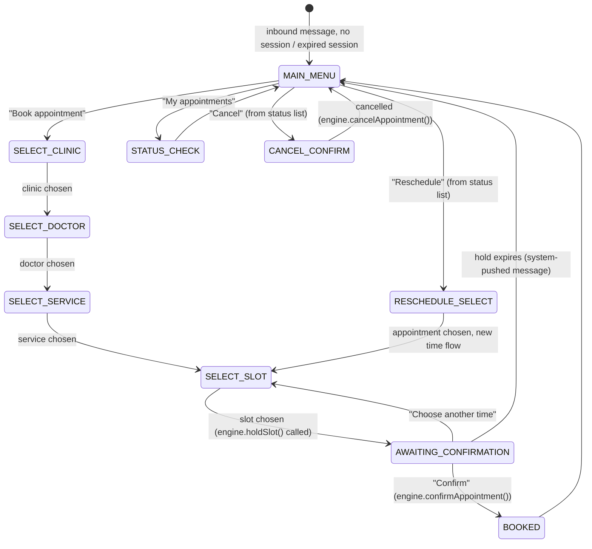

# WhatsApp Integration

Channel: **WhatsApp Business Platform (Cloud API)**, via Meta's hosted
endpoint (not the on-prem Business API). `domain-whatsapp` owns everything
in this document; it calls the appointment engine's public functions for
any actual booking action — it never touches `appointments`/`slots` tables
directly.

## 1. Why WhatsApp needs its own conversation state machine

WhatsApp is a stateless webhook channel — each inbound message is an
isolated HTTP POST from Meta. To let a patient say "10:30" in reply to a
list of slots, the service needs to remember *what it last asked* per
patient. That's `whatsapp_sessions` (`docs/DATABASE.md` §5): a short-lived
state machine per `(tenant, patient_phone)`, independent of the appointment
engine's own state machine.

## 2. Conversation states

Session `context` (jsonb) carries the in-progress selection (clinic id,
doctor id, service id, appointment id being rescheduled/cancelled). Session
`expires_at` is set to a short TTL (e.g. 10 min of inactivity) independent
of the appointment hold TTL — an idle conversation resets to `MAIN_MENU`, it
does not cancel an already-created hold (the hold's own 15-minute expiry,
§`APPOINTMENT_ENGINE.md` §5, governs that).

## 3. Message types used

- **Interactive List Messages** — clinic/doctor/service/slot pickers (WhatsApp
  limits list rows; pagination via a "More options" row when a doctor has
  more open slots than fit).
- **Interactive Reply Buttons** — yes/no style choices (confirm hold, confirm
  cancellation).
- **Template Messages** (pre-approved by Meta, required for any
  business-initiated message outside the 24-hour customer service window) —
  used for confirmations, reminders, cancellation notices, reschedule
  notices. Free-form session messages are only used for messages sent in
  direct reply within an active 24h window that the patient opened.
- Template content is intentionally generic (see §6, data minimization) so
  the same small set of approved templates covers every tenant, rather than
  needing per-tenant Meta approval.

## 4. Inbound webhook processing — idempotency and speed

Meta's webhook delivery is **at-least-once** and expects a fast `200 OK`
(it retries on timeout, which would otherwise cause duplicate processing).
The receiver:

1. Verifies the request signature (`X-Hub-Signature-256` HMAC-SHA256 against
   the app secret — see `docs/SECURITY.md` §Webhook verification). Reject
   with `401` before touching the body if invalid.
2. Immediately persists the raw payload + Meta's `message.id` and enqueues a
   `whatsapp-inbound` BullMQ job, then returns `200`. No business logic runs
   synchronously in the webhook handler — this bounds response time and
   means a slow/failed processing step doesn't cause Meta to retry the
   *webhook delivery* (only the *job* retries, which is safely idempotent).
3. The `whatsapp-inbound` worker dedups on `wa_message_id`
   (`uq_wa_inbound_dedup`, `docs/DATABASE.md` §5) — if this message id was
   already processed, the job is a no-op. This is what makes Meta's
   at-least-once retries and our own BullMQ retries both safe.
4. The worker loads/creates the session, feeds the message through the
   conversation state machine, and calls into `domain-appointment` /
   `domain-tenant` as needed.

## 5. Outbound message idempotency

Every outbound send (confirmation, reminder, etc.) is triggered by a
specific domain event with a natural key (e.g. `appointment_id +
"confirmation"`). Before sending, the notification log
(`docs/DATABASE.md` §6) is checked for an existing `SENT`/`DELIVERED` row
with that key; a duplicate trigger (e.g. a replayed queue job) is a no-op.
This matters most for reminders, where the scan-based scheduler
(`ARCHITECTURE.md` §5) could otherwise double-enqueue across overlapping
scan windows.

## 6. Data minimization on WhatsApp

Per the product requirement to minimize sensitive medical information in
WhatsApp messages:

- Templates reference **doctor name, specialty (if tenant opts in), clinic
  name, date/time, and an appointment reference number** — never a
  diagnosis, reason-for-visit free text, or any clinical note.
- The "reason for visit," when collected at all (optional, dashboard-side
  only, not solicited over WhatsApp), never appears in a WhatsApp template
  or session reply.
- Status/detail lookups ("My appointments") show scheduling metadata only;
  anything more sensitive requires authenticating into the dashboard/patient
  portal, not a WhatsApp reply.
- Session `payload_summary` stored in `whatsapp_messages` is redacted before
  persistence (structured summary of *intent*, e.g. `{"action":"select_slot","slot":"2026-08-24T05:00:00Z"}`,
  not the raw free-text patient message body beyond what's operationally
  needed for debugging).

## 7. Opt-in and consent

`patients.whatsapp_opt_in` must be true before any business-initiated
(template) message is sent — set implicitly when the patient messages the
business first (WhatsApp's own opt-in model), or explicitly via a checkbox
in the WordPress widget/dashboard for bookings made through other channels
that still want WhatsApp reminders. Tenant admins can globally disable the
WhatsApp channel; patients can reply `STOP` (handled as a top-level intent
in the state machine regardless of current session state) to opt out, which
sets `whatsapp_opt_in = false` and is itself an audited action.

## 8. Language

`patients.preferred_language` (default from tenant locale, e.g. `en-IN`,
with `hi-IN` as a first additional target given the India focus) selects the
template language variant. Template sets are authored/approved per
language; the conversation engine picks the variant per session, falling
back to the tenant default if a translation is missing rather than failing
the send.

## 9. Failure handling

- Cloud API send failures (rate-limited, invalid number, template rejected)
  land in `notification_log.status = FAILED` with the provider error,
  surfaced to clinic staff on the appointment's dashboard timeline — WhatsApp
  is never the *only* channel for a confirmation; email is sent in parallel
  when the patient has an email on file, and the dashboard always shows
  ground truth regardless of channel delivery success.
- A session stuck mid-flow past its TTL silently resets to `MAIN_MENU` on
  the next inbound message rather than erroring — WhatsApp UX should never
  dead-end.
